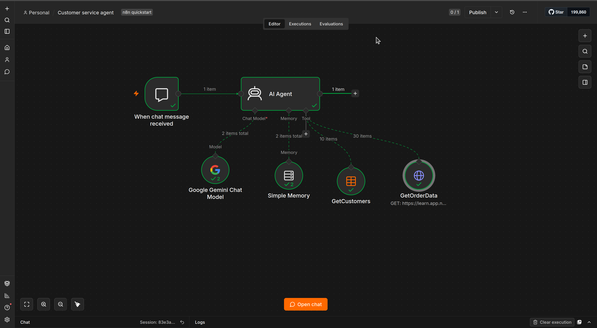

# 🤖 AI Customer Service Agent

An AI-powered customer service agent built with **n8n** that uses an LLM, conversational memory, and external data tools to answer customer and order-related questions.

The agent can retrieve customer information, inspect order data, and provide concise responses based on available data — while being explicitly instructed **not to invent information**.

## 🎥 Workflow Demo

<div align="center">

<a href="https://youtu.be/UzKVVLqPFJ4">
  
</a>

<br>

**▶️ [Watch the workflow demonstration](https://youtu.be/UzKVVLqPFJ4)**

</div>

---

## 🧠 Overview

This project demonstrates how an AI agent can be connected to business data and tools using **n8n**.

Instead of simply generating text, the agent can decide when it needs to retrieve information from connected data sources before responding to the customer.

### The agent can handle:

* 👤 Customer information
* 📦 Order information
* 💰 Order prices
* 📊 Quantities
* 🏷️ Product categories
* 👨‍💼 Employee assignments
* 🔄 Order statuses
* 💬 Multi-turn conversations

---

## 🏗️ Architecture

```text
                    ┌─────────────────────┐
                    │   Customer Message  │
                    └──────────┬──────────┘
                               │
                               ▼
                    ┌─────────────────────┐
                    │    n8n Chat Trigger │
                    └──────────┬──────────┘
                               │
                               ▼
                    ┌─────────────────────┐
                    │      AI Agent       │
                    │                     │
                    │  Reason + Use Tools │
                    └──────┬──────┬───────┘
                           │      │
             ┌─────────────┘      └──────────────┐
             ▼                                   ▼
    ┌─────────────────┐                 ┌─────────────────┐
    │  GetCustomers   │                 │  GetOrderData   │
    │                 │                 │                 │
    │ Customer Data   │                 │ Order API       │
    └─────────────────┘                 └─────────────────┘
             │                                   │
             └──────────────┬────────────────────┘
                            ▼
                    ┌─────────────────┐
                    │   AI Response   │
                    └─────────────────┘

                    ┌─────────────────┐
                    │  Simple Memory  │
                    └────────┬────────┘
                             │
                             ▼
                         AI Agent

                    ┌─────────────────┐
                    │   Chat Model    │
                    └────────┬────────┘
                             │
                             ▼
                         AI Agent
```

---

## ⚙️ Workflow Components

| Component         | Role                                            |
| ----------------- | ----------------------------------------------- |
| **Chat Trigger**  | Receives incoming customer messages             |
| **AI Agent**      | Determines how to answer and which tools to use |
| **Simple Memory** | Maintains conversational context                |
| **GetCustomers**  | Retrieves customer information                  |
| **GetOrderData**  | Retrieves order and product information         |
| **Chat Model**    | Provides the language model used by the agent   |

---

## 🔍 Agent Behavior

The agent is configured with a simple but important principle:

> **Use available data to answer questions. Don't make up information.**

For customer-related requests, it uses the `GetCustomers` tool.

For questions involving orders, prices, employees, or product categories, it uses `GetOrderData`.

This makes the workflow useful for business applications where responses should be grounded in actual operational data.

---

## 💬 Example

### Customer asks:

```text
What is the status of my order?
```

### Agent:

```text
I'll check the order information for you.
```

The AI Agent can invoke the order-data tool to retrieve the relevant information before generating its response.

Similarly, customer-related questions can be routed to the customer database through `GetCustomers`.

---

## 🧩 Data & Tool Integration

### Customer Data

Customer information is retrieved through an n8n Data Table tool named:

```text
GetCustomers
```

The workflow references a `customers` Data Table as its data source.

### Order Data

Order information is retrieved through an HTTP Request tool:

```text
GetOrderData
```

The configured tool is intended to retrieve:

* Order details
* Prices
* Quantities
* Product categories
* Employee assignments
* Order statuses

---

## 🧠 Conversational Memory

The workflow uses **Simple Memory** connected to the AI Agent, allowing the agent to maintain context across messages within a conversation.

Example:

```text
Customer:
What is the status of order 1024?

Agent:
Order 1024 is processing.

Customer:
When was it placed?

Agent:
[Uses the conversation context to understand which order
the customer is referring to.]
```

---

## 🛠️ Tech Stack

```text
n8n
├── AI Agent
├── Chat Trigger
├── Simple Memory
├── Data Table
├── HTTP Request Tool
└── Chat Model
```

The workflow uses a chat model connected to the AI Agent through n8n's AI language-model connection.

---

## 📈 What This Project Demonstrates

This project showcases practical experience with:

* AI agent orchestration
* Workflow automation
* Tool-using LLMs
* Retrieval from business data
* Conversational memory
* API integration
* Customer-service automation
* Data-grounded AI responses
* n8n workflow design

---

## 🚀 Running the Workflow

### 1. Install n8n

Install and start an n8n instance.

### 2. Import the workflow

Import the provided `.json` workflow into n8n.

### 3. Configure credentials

Configure the required credentials for:

* Chat model
* HTTP authentication
* External services

### 4. Configure your data

Connect your own customer Data Table and order API.

### 5. Activate

Activate the workflow and open the n8n chat interface.

---

## 🔐 Security

Credentials and authentication information should **never be committed to the repository**.

Before publishing this workflow publicly:

* Remove private credentials
* Replace demo endpoints with placeholders where necessary
* Store API keys securely
* Review customer data for personally identifiable information

---

## 📂 Repository Structure

```text
.
├── README.md
├── workflow/
│   └── customer-service-agent.json
└── assets/
    └── demo.png
```

---

## 🎯 Future Improvements

Potential extensions for a production implementation include:

* Human-agent escalation
* CRM integration
* WhatsApp integration
* Telegram integration
* Email support
* Ticket creation
* Authentication and authorization
* Customer identity verification
* Analytics and monitoring
* Persistent conversation history
* Automated follow-ups

---

## 👨‍💻 Project

**AI Customer Service Agent**

Built with **n8n + AI Agents + business data tools**.

> A practical example of connecting an LLM to real business workflows instead of using an AI model as a standalone chatbot.
